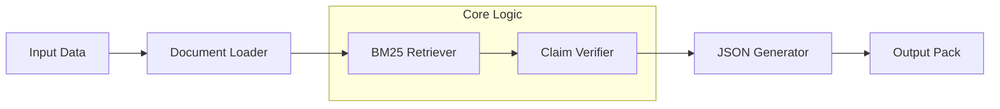

# Verification Pack Generator


A robust, BM25-based pipeline for automated claim verification against legal document corpora. Designed to prioritize **correctness over coverage** by implementing conservative evidence retrieval and strictly verifying prohibitive constraints.

---

## 🏗 System Architecture

The system follows a linear pipeline architecture designed for transparency and reproducibility.



## ✨ Key Features

- **Pinpoint Citations**: Extracts logical evidence mapping with precise document IDs and line ranges (e.g., `doc03:L001-L004`).
- **Conservative Abstention**: Adheres to a strict "Abstain Policy" — labeling claims as `INSUFFICIENT` rather than hallucinating support.
- **Negation Awareness**: Specialized logic to detect prohibitive language ("must not", "do not") versus permissive claims ("may").
- **Audit Trails**: Generates detailed retrieval logs with confidence scores for every verification attempt.

---

## 🚀 Getting Started

### Prerequisites
- Python 3.8 or higher
- `pip` package manager

### Installation

Clone the repository and install the required dependencies:

```bash
git clone https://github.com/BuccKyy/verification-pack-generator.git
cd verification-pack-generator
pip install -r requirements.txt
```

### Usage

Run the full verification pipeline with a single command:

```bash
python run.py --docs ./docs --questions ./questions.jsonl --claims ./claims.jsonl --out ./outputs
```

> **Note:** The input files (`docs`, `questions.jsonl`, `claims.jsonl`) are included in the repository for demonstration.

---

## 📂 Output Structure

The system generates a `packs.jsonl` file where each line is a self-contained verification pack:

```json
{
  "qid": "Q01",
  "answer": "Generated answer synthesis...",
  "claims": [
    {
      "claim": "Specific statement being verified",
      "label": "SUPPORTED",
      "evidence": [
        {
          "doc_id": "doc01",
          "location": "L002-L004",
          "snippet": "Verbatim text from source..."
        }
      ]
    }
  ],
  "retrieval_log": {
    "top_k": 10,
    "candidates": [
      { "doc_id": "doc01", "score": 3.82, "location": "L002" }
    ]
  }
}
```

## 🧠 Engineering Retrospective

### Implementation Details
The core engine utilizes **BM25Okapi** for initial candidate retrieval, followed by a rule-based verification layer. The verifier assigns one of three labels:
- `SUPPORTED`: Strong lexical overlap + semantic alignment.
- `NOT_SUPPORTED`: Direct contradiction or negation mismatch.
- `INSUFFICIENT`: Low confidence or missing critical keywords.

### Observed Failure Modes
1.  **Negation Mismatch (Resolved)**:
    - *Issue*: Claims stating "may be cited" were matching evidence stating "Do not cite" due to high keyword overlap.
    - *Fix*: Implemented regex-based prohibition pattern detection.
2.  **Synonym Gap (Unresolved)**:
    - *Issue*: Exact keyword matching fails when evidence uses synonyms (e.g., "written approval" vs "consent").
    - *Result*: Valid claims occasionally labeled `INSUFFICIENT`.

### Future Roadmap
- [ ] **Semantic Search**: Integrate Sentence-BERT embeddings to resolve synonym gaps.
- [ ] **Multi-line Extraction**: Improve logic for evidence spanning non-contiguous lines.
- [ ] **Confidence Scoring**: Expose probabilistic confidence scores in the API output.

---

## 📁 Project Structure

```
├── 📄 run.py             # Main pipeline entry point
├── 📄 eval.py            # Quality assurance & metrics script
├── 📄 requirements.txt   # Project dependencies
├── 📂 docs/              # Source document corpus
├── 📂 notes/             # Debugging logs & case studies
└── 📂 outputs/           # Generated verification packs
```

---

## 📄 License

This project is open-source and available under the [MIT License](LICENSE).
